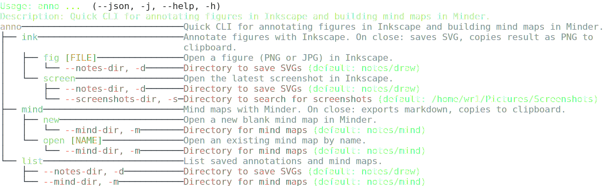

# anno

[](https://github.com/wr1/anno/actions/workflows/ci.yml)
[](https://github.com/wr1/anno/releases/latest)
[](https://www.python.org/)

Quick CLI for annotating figures in Inkscape and building mind maps in Minder.



## Install

```sh
uv tool install .
```

## Workflow

**Annotate a figure:**
```sh
anno ink fig diagram.png   # or: anno ink screen, anno ink new
# annotate in Inkscape
# close Inkscape
# paste (PNG is already in clipboard)
```

**Build a mind map:**
```sh
anno mind new topic        # or: anno mind open topic
# edit in Minder
# close Minder
# paste (markdown is already in clipboard)
```

On close, anno exports in the background and loads the result into the clipboard — just switch to your target app and paste.

## Usage

```sh
anno ink fig diagram.png
anno ink screen
anno mind new
anno mind open issue
anno list
```

Options like `--notes-dir`, `--mind-dir`, and `--screenshots-dir` are available on the relevant subcommands.

## Requirements

- [Inkscape](https://inkscape.org/) (`inkscape` on PATH)
- [Minder](https://github.com/phase1geo/Minder) (`com.github.phase1geo.minder` on PATH)
- `xclip` for clipboard support on Linux
