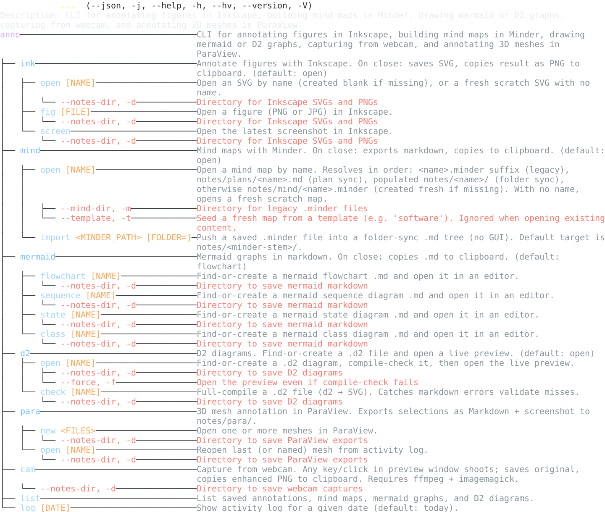

# anno

[](https://github.com/wr1/anno/actions/workflows/ci.yml)
[](https://github.com/wr1/anno/releases/latest)
[](https://www.python.org/)

Quick CLI for annotating figures in Inkscape, building mind maps in Minder, capturing from a webcam or document camera, and annotating 3D meshes in ParaView.

An ergonomics experiment for working with visual data — minimal friction from capture to clipboard.



## Install

```sh
uv tool install .
```

## Fish abbreviations

Source the included script from `~/.config/fish/config.fish`:

```fish
source ~/projects/anno/scripts/shorthand.fish
```

Or add the abbreviations manually:

```fish
abbr ani 'anno ink'    # open Inkscape annotator
abbr anm 'anno mind'   # open Minder mind-mapper
abbr anc 'anno cam'    # capture from webcam / document camera
abbr anp 'anno para'   # launch ParaView with export macro
```

## Daily workflow

Two terminals side by side — one for anno, one for your editor or chat.

**Annotate a screenshot or figure:**
```sh
ani screen           # grabs latest screenshot → Inkscape
ani fig diagram.png  # specific file → Inkscape
ani new              # blank canvas → Inkscape
# annotate, then Ctrl+Q
# switch to target app, paste — PNG is already in clipboard
```

**Shoot from document camera:**
```sh
anc                  # live preview opens; press SPACE to capture
# original saved to notes/draw/
# enhanced + auto-cropped PNG copied to clipboard — just paste
```

**Mind map:**
```sh
anm new topic        # blank mind map → Minder
anm open topic       # reopen existing
# edit, close Minder
# paste — markdown is already in clipboard
```

**Annotate a 3D mesh in ParaView:**
```sh
anp new mesh.vtu     # opens ParaView with export macro installed
anp open             # reopen last mesh
anp open blade_r1    # reopen specific mesh by name
# select cells interactively, then:
# Macros → Anno_Export_Selection
# → saves Markdown + screenshot to notes/para/, opens in gvim
# → close gvim → full content copied to clipboard
```

To set a keyboard shortcut (one-time):
1. Open ParaView via `anno para <file>`
2. Tools → Customize Shortcuts
3. Search `Anno_Export_Selection`, click it, press your key (e.g. Ctrl+Shift+N)

**Review what you did today:**
```sh
anno log             # activity log for today
anno log 2026-04-10  # specific date
anno list            # all saved SVGs and mind maps
```

## Commands

```sh
anno ink new [name]       # blank SVG in Inkscape
anno ink open <name>      # reopen existing SVG
anno ink fig [file]       # embed PNG/JPG into SVG, open in Inkscape
anno ink screen           # use latest screenshot as figure
anno mind new [name]      # blank mind map in Minder
anno mind open <name>     # reopen existing mind map
anno mind import <minder> # apply a saved .minder to its folder tree (no GUI)
anno cam                  # webcam capture → enhanced PNG to clipboard
anno para new <file>      # open mesh in ParaView
anno para open [name]     # reopen last (or named) mesh from log
anno list                 # list annotations and mind maps
anno log [date]           # show activity log (default: today)
```

Options like `--notes-dir`, `--mind-dir`, and `--screenshots-dir` are available on the relevant subcommands.

## Requirements

- [Inkscape](https://inkscape.org/) (`inkscape` on PATH)
- [Minder](https://github.com/phase1geo/Minder) (`com.github.phase1geo.minder` on PATH)
- `xclip` for clipboard support on Linux
- `ffmpeg` and ImageMagick (`ffplay`, `ffmpeg`, `convert` on PATH) for `anno cam`
- [ParaView](https://www.paraview.org/) (`paraview` on PATH) and `gvim` for `anno para`

## Development

```sh
uv sync
uv run pre-commit install   # ruff lint + format on every commit
uv run ruff check src/
uv run ruff format src/
```

CI runs the same checks on every push and PR to `main`.
